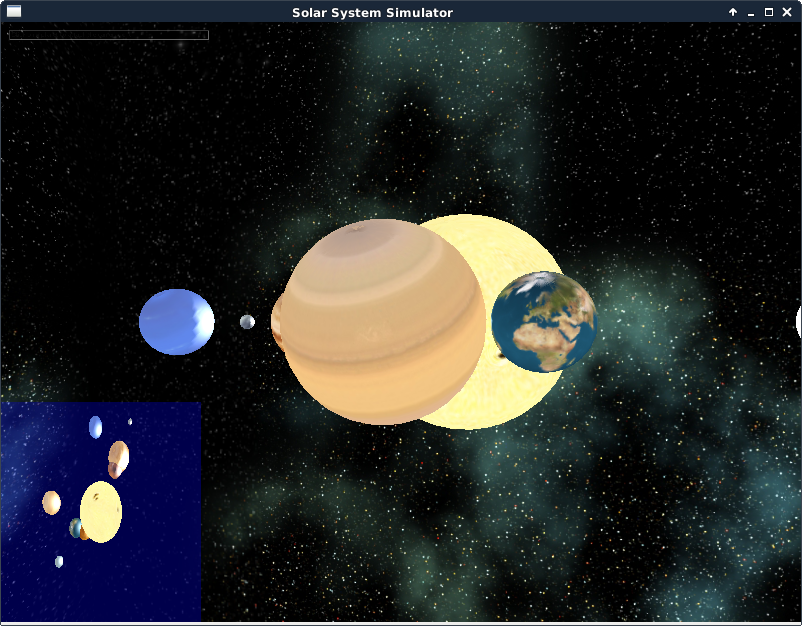

Solar System Simulator
======================

Simple and inaccurate solar system simulator written in C++ using the Irrlicht 3D game engine.

How to build it
---------------

Install the dependencies
* Irrlicht lib 1.8
* SFML Audio 2.5

Run *make* on the command line to generate the solar-system-sim binary.

